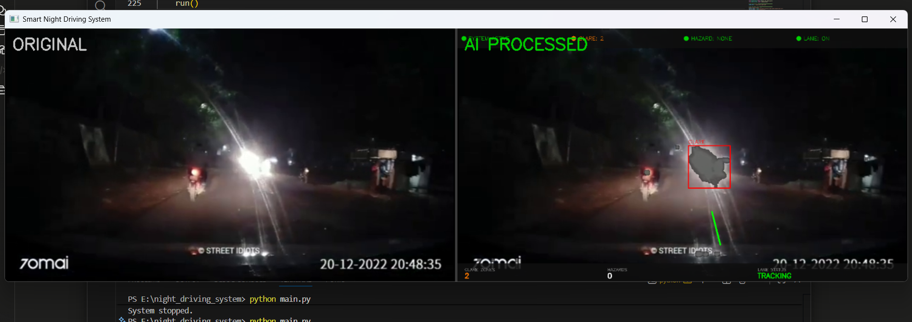
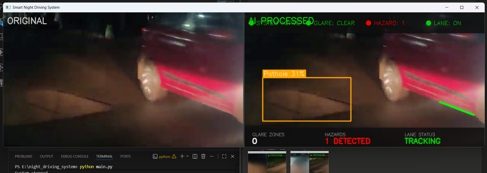
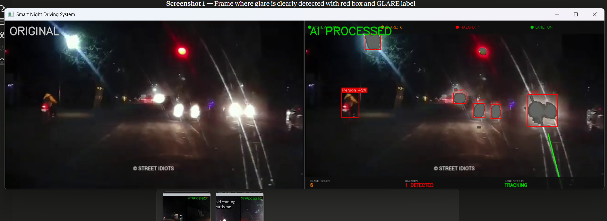

# Smart Night Driving Assistance System

Night driving is genuinely dangerous. Oncoming headlights can blind you for 2-5 seconds — and at 60km/h, that's 80+ meters of road you can't see. Add potholes and you have a recipe for accidents.

This project is my attempt to fix that using computer vision. It runs in real time, detects headlight glare, reduces it selectively, highlights lane markings, and flags road hazards before you reach them.

---

## What it does

**Glare detection and reduction**
The camera picks up high-intensity light sources (headlights) and dims only that region — not the whole screen. The road around it stays visible.

**Lane enhancement**
Using Canny edge detection and Hough transforms, the system draws green guide lines on the road even when your eyes are struggling with glare.

**Pothole and hazard detection**
A custom YOLOv8 model trained on 5839 day and night pothole images detects road hazards. A second model handles vehicles, pedestrians, and traffic lights.

**Live status overlay**
Clean status bar showing glare count, hazard alerts, and lane tracking status in real time.

---

## Demo

### Glare detection + lane tracking


### Pothole detection


### Person and hazard detection at night


---

## How to use it in your car

This is the practical setup if you want to actually run this while driving:

**What you need:**
- A USB webcam (Rs 800-1500, any 1080p model works)
- Your laptop mounted on the dashboard
- A USB power bank or car charger to keep the laptop running

**Setup:**
1. Mount the USB webcam on your dashboard facing forward
2. Connect it to your laptop
3. Open `main.py` and change `use_camera=False` to `use_camera=True`
4. Run the system before you start driving
5. The laptop screen shows the processed output — glare reduced, hazards highlighted

The system processes each frame in real time (~55ms per frame) so there's no noticeable lag. You can also connect your laptop to a small HDMI screen mounted higher up on the dashboard if you don't want to look down.

For a more permanent setup, a Raspberry Pi 4 with a Pi camera module can run the same code and costs around Rs 6000-8000 total with a small display screen.

---

## Tech stack

- Python 3.12
- OpenCV 4.8 — video processing, glare detection, lane detection
- Ultralytics YOLOv8 — hazard and pothole detection
- NumPy 1.26

---

## Project structure

```
night_driving_system/
│
├── videos/                     # test videos
├── pothole_combined/           # training dataset (5839 images)
├── runs/detect/
│   └── pothole_night_model/
│       └── weights/best.pt     # trained pothole model
│
├── module2_glare.py            # glare detection + reduction
├── module3_lanes.py            # lane enhancement  
├── module4_hazards.py          # hazard detection
├── train_pothole.py            # training script
├── combine_datasets.py         # dataset merger
└── main.py                     # run this
```

---

## Installation

```bash
git clone https://github.com/Harshi06-code/night-driving-system.git
cd night-driving-system

pip install opencv-python==4.8.0.76 numpy==1.26.4 ultralytics
```

---

## Running it

**With a test video:**
```bash
python main.py
```

**With live camera:**
Open `main.py`, scroll to the bottom and change:
```python
run(use_camera=False)
# to
run(use_camera=True)
```
Then run `python main.py`

Press `Q` to quit.

---

## Training data

Three Roboflow datasets combined:

| Dataset | Condition | Images |
|---|---|---|
| Pothole Detection System | Daytime | ~3300 |
| Pothole at Night | Night | ~1900 |
| GeraPotHole | Mixed | ~608 |
| **Total** | **Day + Night** | **5839** |

All class names were standardized to `pothole` before combining since the datasets used different naming conventions (Pothole, Potholes, pothole).

---

## Model performance

Trained YOLOv8n on the combined dataset:
- mAP@50: 56.5% (11 epochs, early stopped)
- Inference speed: ~55ms per frame on CPU
- Detection threshold: 0.25 confidence

Night detection is harder than daytime — motion blur and low contrast reduce confidence scores. The system detects potholes reliably on well-lit or daytime footage, and partially on night footage depending on road surface visibility.

---

## Known limitations

- Glare reduction works on white/yellow headlights — very red taillights are sometimes missed
- Lane detection needs visible lane markings to work — unmarked Indian rural roads are a challenge
- Pothole detection confidence drops significantly on dark roads with motion blur
- Currently a software prototype — needs a mounted camera for real car use

---

## What I'd improve with more time

- Retrain with 15000+ night-specific images for better dark-road accuracy
- Port to Android using TensorFlow Lite so any smartphone can run it
- Add audio warnings so the driver doesn't need to look at the screen
- Test on Raspberry Pi 4 for a standalone Rs 7000 dashcam unit

---

## Author

Harshitha — B.Tech CSE, Amrita Vishwa Vidyapeetham, Coimbatore

Built this as part of my ML portfolio while learning computer vision from scratch. Every module was written and debugged manually — no boilerplate templates.

---

## License

MIT License — use it, modify it, build on it.
